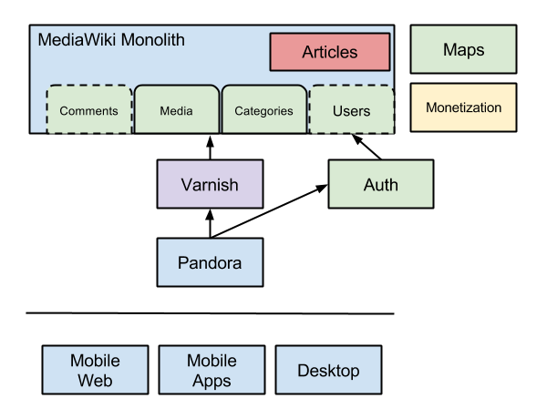

# Pandora Design Document

This document provides an overview of the Pandora design. 

## What is Pandora?

Pandora is a service that provides an
[facade](http://en.wikipedia.org/wiki/Facade_pattern) in the form of an API for
the article experience. It will

 * Provide a simplified
	 [guidelines](https://github.com/Wikia/guidelines/tree/master/APIDesign)
	 compliant content interface to articles.
 * Enable rapid prototyping and iteration of the above
 * Hide the complexity of MediaWiki
 * Decouple content which will enable
  * Hypermedia API designs
  * Better caching
  * Ability to fan-out requests

## Goals

 1. Provide an API that satisfies the [design
    guide](https://github.com/Wikia/guidelines/tree/master/APIDesign) for mobile
    web.
 2. Provide an archetype API that can be used for other services.
 3. Provide a foundation upon which to expand the service and API to support
    mobile apps and partners.

## Nouns

The content ontology or nouns are being worked out in [this
document](https://docs.google.com/document/d/1N_AFFmdzmjtzTK8g4LOcrC7RdEi9bXy_j-UyihKssTs/edit?usp=sharing).

 * /articles/Kermit_the_frog
 * /articles/Kermit_the_frog/contributors/

## Existing Mercury API

An example query from the current Mercury API can be found
[here](http://muppet.wikia.com/api/v1/Mercury/Article?title=Kermit%20the%20Frog).
This will be used as a reference point for mobile web.

## Milestones

 1. `application/hal+json` API for articles
 2. `application/hal+json` API that is feature complete with Mercury and could be
   used as a replacement

## Implementation Notes

 * The service will be written in [Clojure](http://clojure.org/).
 * The Mercury API
   [payload](http://muppet.wikia.com/api/v1/Mercury/Article?title=Kermit%20the%20Frog)
	 contains elements that change at different rates which suggests that there might
	 be different logical groupings and different caching characteristics. What
	 are these groupings?
 * Given the above it may also make sense to, by default, only include links to
	 these resources and allow them to be expanded via `_embedded`. This seems to
	 be more the spirit of a hypermedia API.

### Architecture & Data Flow

This is similar to how the Mercury service is currently designed. Some of the
content components are called out (comments, media, users as examples) to
suggest that they may be migrated to separate services in the future. The list
is not exhaustive.

To improve performance, a caching layer (varnish) will be added between Pandora
and MediaWiki.

### Why Clojure?

The following answers questions from the [draft language selection
guidelines](https://github.com/Wikia/guidelines/blob/language-selection/Process/ProgrammingLanguageSelection.md).

 1. Clojure is one of the supported languages. We feel that it is a good choice
    for this project because of our (@nmonterroso, @drsnyder) experience with
    Clojure and the availability of execellent
    [tooling](http://www.http-kit.org/index.html) for
    [testing](https://github.com/marick/Midje) and
    [building](http://clojure-liberator.github.io/liberator/)
    [web](https://github.com/ring-clojure/ring)
    applications on the JVM.
 2. How will Clojure be deployed in production? There is an existing deploy
    tools plugin for Clojure that was created for vignette.
 3. The industry support for Clojure is good. There are dozens of production
    deployments, several confereces per year (including one in Poland in 2014),
    training courses available and several books. There are 8k+ questions on
    stackoverflow, and lots of [community
    resources](http://clojure.org/community). Being a JVM langague it stands on
    the shoulders of (industry) giants.
 4. Is there existing organizational expertise for the language? Yes. Both Damon
    and Nelson have experience with production systems written in Clojure.
 5. Does the language effect the organization’s ability to recruit? Time will
    tell, but I believe that it will have a positive impact in SF and a neutral
    to positive impact in Poland.
 6. What is the expected learning curve for becoming productive in the language?
    From our experience it takes a week or two to get up to speed. We have had
    good results from working through [this
    tutorial](http://iloveponies.github.io/) to get up to speed on the language.
    Having existing projects to work with and in-house expertise helps to
    accelerate the time-to-productive learning curve.
 7. There is external training available and we are working on producing some
    internal training.
 8. Are there textbooks and reference materials available. Yes, there are
    several great books. One of our favorites is [The Joy of
    Clojure](http://www.joyofclojure.com/).
 9. You can see the list of companies using clojure
    [here](http://clojure.org/Companies). The list inclues eBay, Groupon,
    Heroku, Factual, Intuit, Netflix, Puppet Labs, Prismatic, SoundCloud,
    ThoughtWorks, Zendesk and many others.
 10. Is there a pool of developers in both Poland and the US that could be hired
     to support and expand the development of services written in the language?
     Although this is difficult to measure I believe the answer is yes. There
     were at least 3 conferences in Poland in 2014 that included Clojure as
     topics: [EuroClojure June 2014](http://euroclojure.com/2014/) Kraków,
     [Polyconf October 2014](http://polyconf.com/) Poznan, and [Lambda Days
     Februray 2014](http://www.lambdadays.org/) Kraków.

## Open Questions

 * Is all the data currently being delivered by the Mercury API used?
 * Do we need to support partial payloads and transclusion?
 * What should be embedded and what shouldn’t by default. For example, do we
	 always need to include both ‘contributors’ and ‘users’?

## FAQ

 * Will the article HTML content change from what is now in Mercury?
   No. At the moment we are planning on leaving the *values* in the mercury
	 payload intact. The keys however are subject to change.
